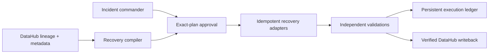

# Lineage Lifeboat

**A DataHub-powered recovery compiler that turns live lineage into an approved,
dependency-correct, executable recovery program.**

[Open the live judge console](https://lifeboat.datahub-hackathon.aaronmathias.com) ·
[View the source](https://github.com/amathias/lineage-lifeboat) ·
[Follow the under-three-minute recording runbook](docs/DEMO_RUNBOOK.md)

Demo video: **pending recording and public upload**. The repository does not claim that a video
exists yet.

Lineage Lifeboat is built for incident commanders who need to restore trust, not
just infrastructure. It binds a recovery plan to DataHub lineage, orders every
step deterministically, executes real adapters against a disposable local data
estate, validates every result, supports safe resume, and writes the verified
outcome back through a supported DataHub `globalTags` update when live
credentials are configured.

## Architecture



## Three-step judge path

1. Open the live console and initialize the disposable estate, then trigger the confirmed outage.
2. Compile the DataHub-bound recovery DAG and approve its exact plan ID.
3. Execute the adapters, inspect validation evidence, and confirm verified recovery and writeback.

## What judges can run

The complete local workflow needs no paid infrastructure and takes seconds:

```powershell
python -m venv .venv
.\.venv\Scripts\python.exe -m pip install -e ".[dev]"
.\.venv\Scripts\python.exe -m lineage_lifeboat.cli demo-run `
  --run-id judge-demo-001 `
  --approved-by demo-incident-commander `
  --confirm-project lineage-lifeboat
```

The command really executes this sequence:

1. Creates a disposable embedded DuckDB commerce estate and derived artifacts.
2. Deletes exactly six local recovery targets while preserving the healthy
   customer prerequisite and unrelated inventory branch.
3. Compiles the canonical DataHub graph into five topological recovery waves.
4. Records explicit approval for the exact plan ID.
5. Restores Parquet into DuckDB, runs two SQL transforms, builds feature/model
   JSON artifacts, and refreshes the dashboard artifact.
6. Runs required existence, schema, row-count, checksum, freshness,
   business-rule, model-metric, and input-fingerprint validations.
7. Persists a resumable run ledger plus JSON and Markdown reports.
8. When `DATAHUB_TOKEN` is configured, performs the supported `globalTags`
   writeback and immediately verifies it through DataHub MCP.

No cloud action is performed by the demo. Every executed action targets the
project's dedicated local state directory.

## Judge-facing recovery console

Start the service and open <http://localhost:8101>:

```powershell
.\.venv\Scripts\python.exe -m lineage_lifeboat
```

The single-screen console exposes the complete story without a terminal:

- initialize the disposable estate;
- trigger the explicitly confirmed outage;
- inspect the DataHub impact graph and excluded inventory branch;
- compile deterministic dependency waves;
- approve the exact plan;
- execute or resume adapters;
- inspect per-step adapter and validation evidence;
- confirm final local recovery and DataHub writeback status.

The API contract is also visible at <http://localhost:8101/api/docs>.

## Recovery graph and real adapters

| Wave | Recovery target(s) | Adapter | Required evidence |
|---|---|---|---|
| 1 | `raw.orders` | Parquet snapshot restore | exists, schema, row count |
| 2 | `analytics.stg_orders` | DuckDB SQL transform | exists, schema, checksum |
| 3 | `analytics.customer_revenue` | DuckDB SQL transform | exists, schema, nonnegative revenue |
| 4 | `features.customer_value` | deterministic Python build | exists, freshness |
| 4 | `dashboards.executive_revenue` | report refresh | exists, input fingerprint |
| 5 | `models.churn_model` | deterministic Python build | artifact load, accuracy threshold |

`raw.customers` is a healthy precondition. `inventory.forecast` is unrelated and
must remain excluded and unchanged.

Execution is resumable. Verified steps retain their idempotency keys and are not
rerun after a later step fails. Required validation failures stop the run before
any consumer can execute.

## DataHub integration and preserved live proof

The project uses open-source DataHub plus the DataHub MCP Server:

- eight exact `lifeboat.` dataset fixtures and six lineage edges;
- entity and complete direct-lineage reads through MCP;
- deterministic planning bound to graph fingerprint
  `72accff2049653af2a7134d41559d3bb0e8ad9a27edefe2ed986155b85dc524b`;
- supported DataHub RestEmitter `MetadataChangeProposal` writeback using the
  `globalTags` aspect;
- immediate MCP reread proving the marker tag;
- namespace-scoped reset with fail-closed readiness evidence.

The deployed immutable-evidence candidate
`a304df864a9eedff91862d0d4642484f0ab89984` passed the coordinator's two-run
public live gate. Both approved recoveries completed six of six steps with
verified live DataHub MCP context and verified writeback/reread. Run A's receipt
and ledger hashes remained unchanged after run B, while the stable writeback
component and vertical-slice aggregate also remained unchanged. Exact paths,
hashes, endpoint checks, archive details, and rollback candidate are recorded in
`COORDINATOR_HANDOFF.md`.

For a fresh live integration run, provide the token out of band:

```powershell
$env:DATAHUB_GMS_URL = "http://127.0.0.1:8080"
$env:DATAHUB_MCP_URL = "http://127.0.0.1:8000/mcp"
$env:DATAHUB_TOKEN = "<supplied-out-of-band>"
.\.venv\Scripts\python.exe -m lineage_lifeboat.cli datahub-vertical-slice `
  --run-id live-evidence-001
```

Commands fail honestly when the token or required proof is absent. Tokens are
never written into plans, reports, examples, screenshots, or Git.

## Approval, failure, and resume

The CLI exposes each transition independently:

```powershell
.\.venv\Scripts\python.exe -m lineage_lifeboat.cli demo-initialize --confirm-project lineage-lifeboat
.\.venv\Scripts\python.exe -m lineage_lifeboat.cli demo-outage --confirm-project lineage-lifeboat
.\.venv\Scripts\python.exe -m lineage_lifeboat.cli demo-plan --run-id incident-001
.\.venv\Scripts\python.exe -m lineage_lifeboat.cli demo-approve --run-id incident-001 --plan-id <exact-plan-id> --approved-by incident-commander
.\.venv\Scripts\python.exe -m lineage_lifeboat.cli demo-execute --run-id incident-001
```

Running `demo-execute` again resumes a failed run. Previously verified steps are
loaded from `APP_STATE_DIR/recovery-runs/<run-id>/run.json` and skipped.

After a verified DataHub writeback/reread, the exact scrubbed receipt is
atomically retained at
`APP_STATE_DIR/recovery-runs/<run-id>/datahub-writeback-receipt.json`. Its bytes
and SHA-256 are bound to that `RecoveryRun`; a later run uses a different
validated directory and cannot replace prior evidence. A conflicting existing
file fails closed. Recovery execution never overwrites the stable
`APP_STATE_DIR/datahub-receipts/writeback-receipt.json` component referenced by
the authoritative Milestone B vertical-slice readiness record.

## Evidence and examples

- [Recovery plan](examples/recovery-plan.json)
- [Recovery report (JSON)](examples/recovery-report.json)
- [Recovery report (Markdown)](examples/recovery-report.md)
- [Under-three-minute demo runbook](docs/DEMO_RUNBOOK.md)
- [Architectural decisions](docs/DECISIONS.md)
- [Coordinator live evidence handoff](COORDINATOR_HANDOFF.md)

Regenerate deterministic examples:

```powershell
.\.venv\Scripts\python.exe scripts\generate_examples.py
```

Verify the full clean local story stays under three minutes:

```powershell
.\.venv\Scripts\python.exe scripts\verify_judge_demo.py
```

## Tests and lint

```powershell
.\.venv\Scripts\ruff.exe check app tests scripts
.\.venv\Scripts\python.exe -m pytest --cov=lineage_lifeboat --cov-report=term-missing
```

The suite covers graph ordering, cycles, missing adapters, namespace isolation,
DataHub read/write contracts, reset safety, approval gates, exact plan binding,
idempotency, injected adapter failure and resume, validation blocking, immutable
per-run receipt retention across multiple runs, path traversal and retention
failure, no-token behavior, report evidence, and the end-to-end console API.

## API summary

| Method | Path | Purpose |
|---|---|---|
| `GET` | `/api/health` | process liveness only |
| `GET` | `/api/readiness` | live DataHub and receipt readiness |
| `POST` | `/api/demo/initialize` | initialize confirmed disposable estate |
| `POST` | `/api/demo/outage` | execute confirmed local outage |
| `POST` | `/api/recovery/plan` | compile and persist a plan |
| `POST` | `/api/recovery/{run_id}/approve` | approve the exact plan ID |
| `POST` | `/api/recovery/{run_id}/execute` | execute the approved plan |
| `POST` | `/api/recovery/{run_id}/resume` | resume without rerunning verified steps |
| `GET` | `/api/recovery/{run_id}` | inspect run and evidence |

## Scope and limitations

Lineage Lifeboat demonstrates dependency-aware recovery compilation and verified
execution for the included DuckDB, Python artifact, and report adapters. It does
not replace backup infrastructure, perform cloud failover, guarantee recovery
time, support every data platform, or autonomously execute production changes.
The optional LLM layer remains out of scope; deterministic code is the planning
and execution authority.

## Repository map

- `app/lineage_lifeboat/planner.py` - deterministic graph compiler
- `app/lineage_lifeboat/estate.py` - disposable estate, adapters, validations
- `app/lineage_lifeboat/workflow.py` - approval, execution, resume, reports
- `app/lineage_lifeboat/datahub_vertical_slice.py` - live MCP and writeback proof
- `app/lineage_lifeboat/static/` - judge-facing recovery console
- `demo/snapshots/` - deterministic local recovery inputs
- `examples/` - committed plan and report evidence

Apache-2.0 licensed. Built as an independent project for the DataHub Agent
Hackathon under the **Agents That Do Real Work** category.
